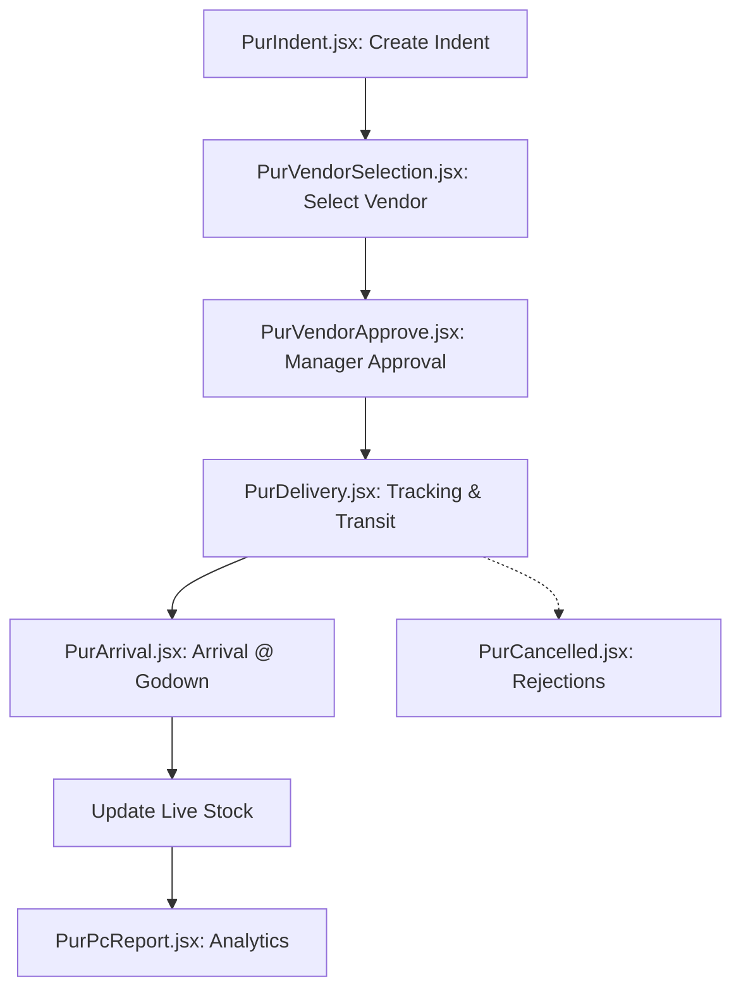
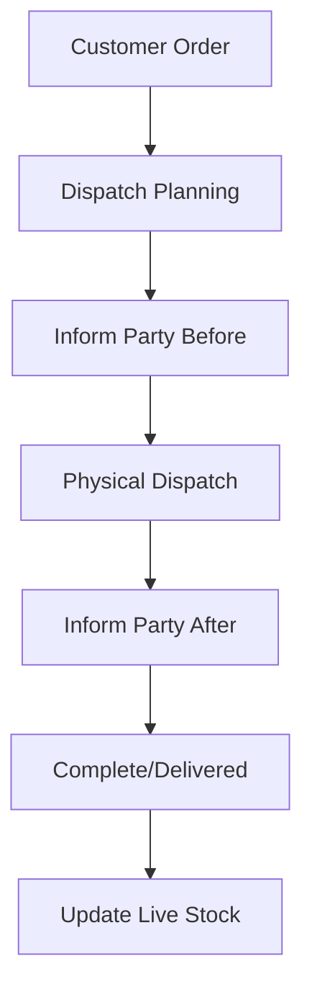
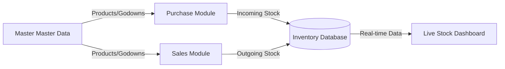
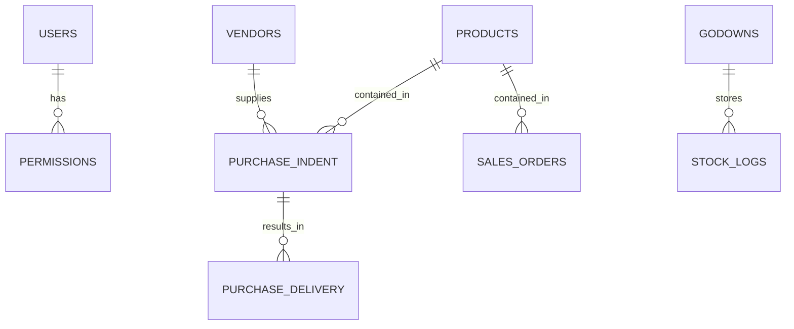
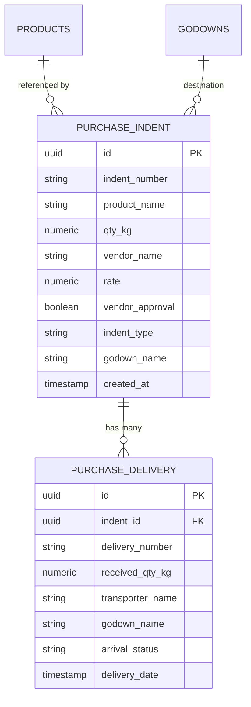

# VPR Systems - Enterprise Resource Planning (ERP)

VPR Systems is a high-performance, modern ERP and Inventory Management system designed for streamlined operations across Sales, Purchase, and Inventory modules. Built with a focus on real-time data accuracy, granular security, and a premium user experience.

## 🔄 System Workflows

### Purchase Workflow (Detailed Process)


### Sales (Dispatch) Workflow


## 📊 Data Architecture

### Data Flow Diagram


### Entity Relationship (ER) Diagram


### 🛍 Detailed Purchase Entity Relationship


## 🚀 Key Modules & Workflows

### 1. Sales (OTD - Order to Delivery)
Manage the full lifecycle of outgoing orders:
- **Dashboard:** Real-time analytics of sales performance.
- **Order Management:** Create and track customer orders.
- **Dispatch Planning:** Organize logistics and transporter assignments.
- **Communication:** Automated "Inform Before Dispatch" and "After Dispatch" checkpoints.
- **Reporting:** Comprehensive PC Reports for sales history.

### 2. Purchase (Procurement)
End-to-end procurement pipeline:
- **Indent:** Create purchase requests for needed materials.
- **Vendor Selection:** Manage quotes and select the best suppliers.
- **Approval:** Managerial approval workflow for purchase orders.
- **Delivery & Arrival (Aawak):** Track incoming shipments and verify received quantities in Godowns.

### 3. Inventory & Stock Management
Centralized control over assets:
- **Live Stock Dashboard:** Real-time tracking of Opening vs. Closing stock in KG.
- **Internal Transfers:** Log movements between different Godowns.
- **Product Master:** Advanced product management with categorization and status toggling (Active/Inactive).
- **Master Config:** Manage Godowns, Transporters, Customers, and Vendors.

## 🔐 Security & Permissions
The system features a robust, granular permission model:
- **Super Admin:** Full, unrestricted access to all modules and settings.
- **Admin:** Permissions are defined via a "Page Access" checklist. Admins can only see the modules explicitly granted to them.
- **User:** Basic access typically restricted to Profile and assigned operational tabs.

## 🛠 Tech Stack
- **Frontend:** React.js (Vite)
- **Styling:** Vanilla CSS + Tailwind CSS
- **Database/Auth:** Supabase (PostgreSQL)
- **State Management:** Zustand
- **Icons:** Lucide React / FontAwesome
- **PDF/Excel:** jsPDF, xlsx

## ⚙️ Setup & Installation

1. **Clone the repository**
2. **Install dependencies:**
   ```bash
   npm install
   ```
3. **Environment Variables:**
   Create a `.env` file in the root based on `.env.example`:
   ```env
   VITE_SUPABASE_URL=your_supabase_url
   VITE_SUPABASE_ANON_KEY=your_supabase_anon_key
   ```
4. **Run Locally:**
   ```bash
   npm run dev
   ```

## 📦 Deployment
The project is pre-configured for modern hosting platforms:
- **Vercel:** `vercel.json` handles SPA routing rewrites.
- **Netlify:** `_redirects` file in the `public` folder handles routing.
- **Build Command:** `npm run build`

---
*Powered by VPR Systems - Optimized for Growth*
